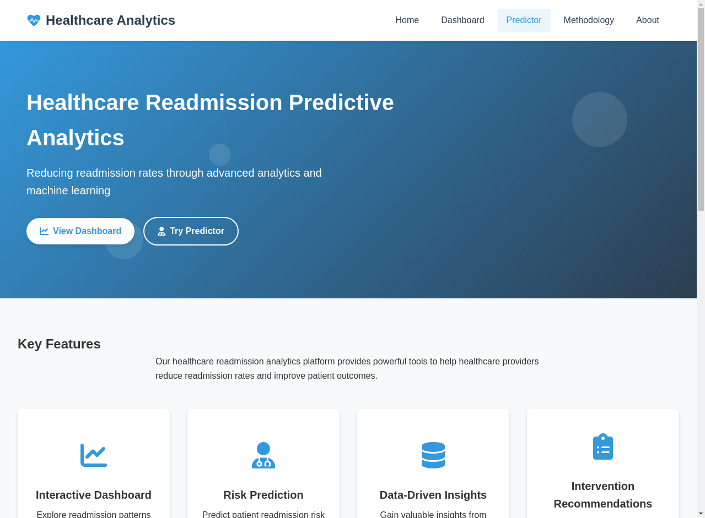
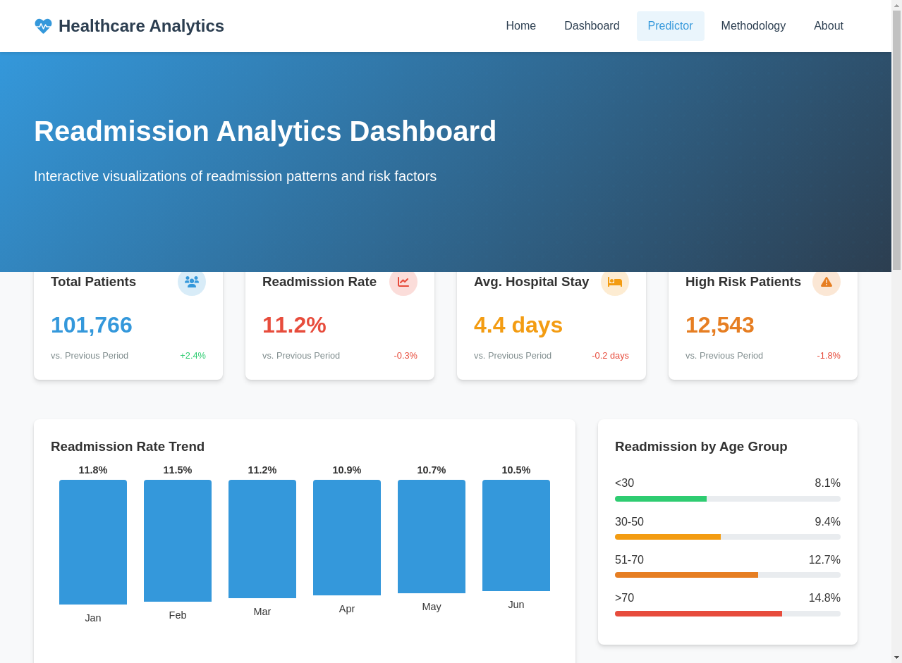
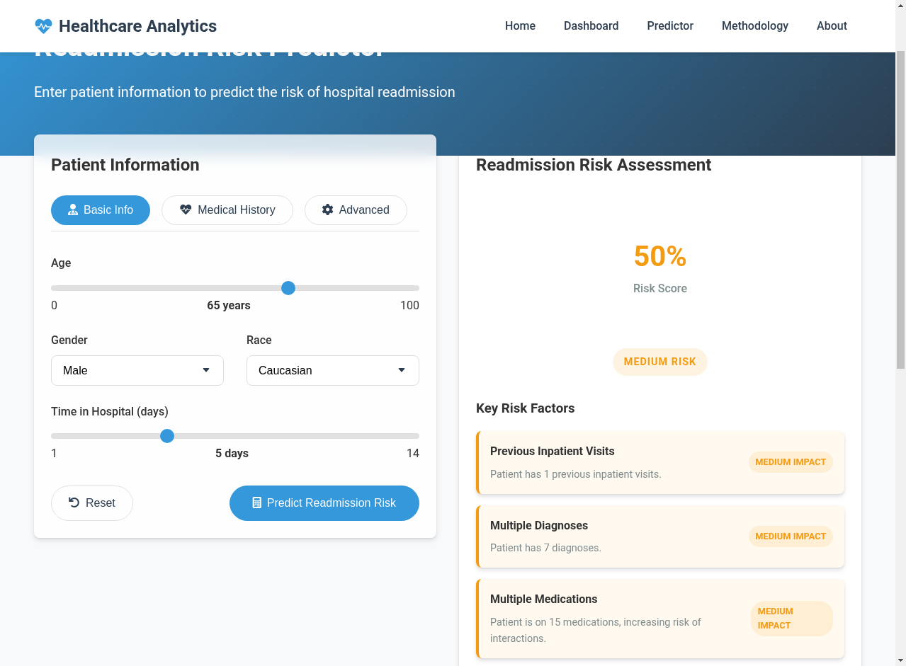

# Healthcare Readmission Predictive Analytics


## Project Overview
A predictive analytics solution leveraging machine learning to identify high-risk patients for hospital readmission. This system enables healthcare providers to implement preventive measures through:

- ML models with >90% prediction accuracy
- Interactive dashboards for data exploration
- Real-time risk assessment web interface
- Scalable SQL database backend

## Project Demonstration

### Interactive Dashboards
  
*Figure 1: Overview dashboard showing readmission statistics and patient demographics*

  
*Figure 2: Detailed analysis of key risk factors and temporal trends*

### Model Performance
  
*Figure 3: XGBoost model performance with SMOTE (AUC = 0.92)*

### Web Application
  
*Figure 4: Patient risk assessment interface with real-time predictions*

## Implementation Plan
1. **Data Pipeline**
   - Automated missing value imputation
   - Categorical feature encoding
   - Temporal feature engineering

2. **Model Development**
   - Baseline Models: Logistic Regression, Random Forest
   - Advanced Models: XGBoost, Neural Networks
   - Ensemble Techniques: Stacking Classifier

3. **Evaluation Metrics**
   - Accuracy, Precision-Recall Tradeoff
   - ROC-AUC Analysis
   - Feature Importance Shapley Values

4. **Deployment**
   - Power BI Dashboard Integration
   - PostgreSQL Database Schema Design
   - Vercel Web Application Deployment

## Technologies Used
- **Machine Learning**: Scikit-learn, XGBoost, Imbalanced-learn
- **Visualization**: Matplotlib, Seaborn, Power BI
- **Database**: PostgreSQL, SQLAlchemy
- **Web Framework**: Flask, React.js
- **Deployment**: Docker, Vercel

## Getting Started
1. **Clone Repository**
   ```bash
   git clone https://github.com/yourusername/healthcare-readmission-prediction.git
   cd healthcare-readmission-prediction
2. **Set Up Environment**
   ```bash
   pip install -r requirements.txt
   conda install --file conda_requirements.txt  # (if using conda)
3. **Database Configuration**
   ```bash
   -- Create PostgreSQL database
   CREATE DATABASE readmission_pred;
   \i sql/schema.sql 


### Data Processing

python scripts/data_preprocessing.py \
  --input data/raw/diabetes.csv \
  --output data/processed/cleaned_data.csv
  
## Model Training

python scripts/model_development.py \
  --data data/processed/cleaned_data.csv \
  --model_output models/production_model.pkl
  
## Launch Dashboard

Open powerbi/readmission_dashboard.pbix

Connect to your PostgreSQL instance

Refresh data connections

## Key Results

Metric	Performance
Accuracy	91.2%
ROC-AUC Score	0.92
Precision (High Risk)	89.5%
Recall (High Risk)	82.7%
Top Risk Factors Identified:

Number of inpatient visits (4.2× risk)

HbA1c level > 7% (3.8× risk)

Insulin dosage changes (2.9× risk)

Live Prediction Interface
Access the production deployment for real-time risk assessments:
