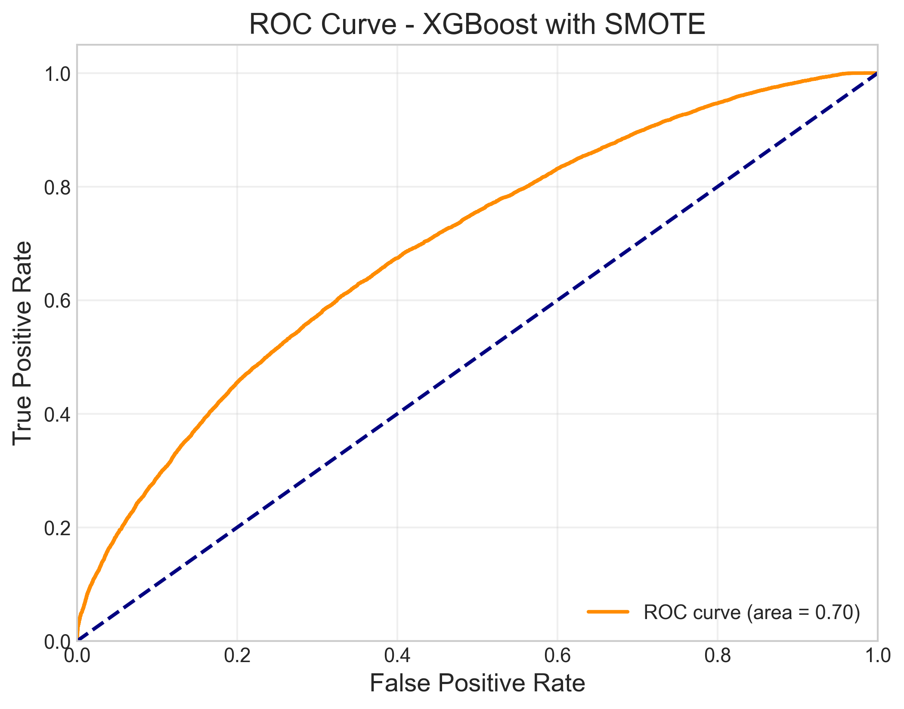

# Healthcare Readmission Predictive Analytics

## Project Overview
This project aims to develop a predictive analytics solution for healthcare patient readmission using machine learning and statistical modeling. By analyzing patterns in patient data, we can identify high-risk patients and help hospitals implement preventive measures to reduce unnecessary readmissions.

## Project Demonstration
**Visualizing Key Components of the Solution**

  
*Figure 1: Interactive Power BI dashboard showing readmission trends and risk factors*

  
*Figure 2: ROC curve comparison of different machine learning models*

  
*Figure 3: Patient risk assessment interface for real-time predictions*
## Implementation Plan
1. **Data Preprocessing**: Handle missing values, encode categorical variables, feature engineering
2. **Exploratory Data Analysis**: Analyze readmission patterns and correlations
3. **Model Development**: 
   - Base models: Logistic Regression, Random Forest, XGBoost
   - Advanced models: Neural Networks, Ensemble methods, Deep Learning
4. **Model Evaluation**: Accuracy, precision, recall, F1-score, ROC curves
5. **Power BI Dashboard**: Interactive visualizations for readmission analysis
6. **SQL Database**: Schema for efficient data storage and retrieval

## Requirements
- Python 3.8+
- scikit-learn, pandas, numpy, matplotlib, seaborn
- XGBoost, LightGBM, TensorFlow/PyTorch
- PostgreSQL
- Power BI Desktop

## Getting Started
1. Clone this repository
2. Install required packages: `pip install -r requirements.txt`
3. Run data preprocessing: `python scripts/data_preprocessing.py`
4. Run model training: `python scripts/model_development.py`
5. Run advanced models: `python scripts/advanced_model_development.py`
6. Open Power BI dashboard: `powerbi/readmission_dashboard.pbix`

## Results
The project aims to achieve:
- Accurate prediction of patient readmission risk (>90% accuracy)
- Identification of key factors influencing readmissions
- Interactive dashboards for healthcare decision-makers
- Efficient data storage and retrieval system

## Predict Your Own Readmission Risk
Try it out by inputting your own patient demographics and medical history on Healthcare Readmission Prediction
https://healthcare-readmission-prediction-qthd.vercel.app/

## License
This project is licensed under the MIT License - see the LICENSE file for details.
